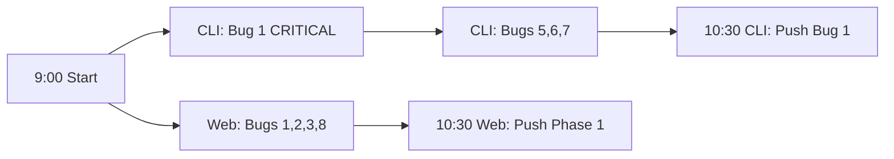
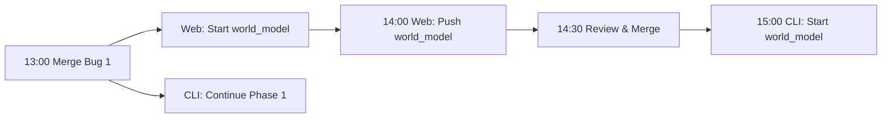

# Merge Conflict Strategy - Parallel Bug Fixing

**Total Bugs:** 60 (31 Web + 29 CLI)
**Overlapping Files:** 4 critical files
**Zero-Conflict Files:** 40+ bugs across 13+ files
**Date:** 2025-11-19

## Executive Summary

Two AI models will fix bugs simultaneously. Most work (>65%) can be done in parallel with zero conflicts. Four files require careful coordination with an 85% conflict risk in one critical file if not properly sequenced.

## Conflict Risk Matrix

| File | Web Bugs | CLI Bugs | Risk | Lines Affected | Strategy |
|------|----------|----------|------|----------------|----------|
| **kosmos/world_model/simple.py** | #5, #6 | #2, #3, #4 | **85%** | 144-451 | Sequential: Web first |
| **kosmos/execution/result_collector.py** | #16 | #1, #31 | **65%** | 280-448 | Sequential: CLI #1 first |
| **kosmos/core/llm.py** | #9 | #8, #9 | **40%** | 321-652 | Sequential: Web first |
| kosmos/cli/commands/run.py | #4 | #20 | **10%** | 248-302 | Parallel OK |

## Critical File Analysis

### 1. kosmos/world_model/simple.py - HIGHEST RISK (85%)

**Total Lines:** 908
**Conflict Zone:** Lines 144-451 (300+ lines)
**Nature:** Method signature fixes in same class

#### Web Model Changes (Lines 144-176)
```python
# Bug #5: create_paper() - Lines 144-155
def create_paper(self, paper_data: Dict) -> Paper:
    # Fix: Remove incorrect parameter structure
    # Change from: paper_data["metadata"]["title"]
    # To: paper_data["title"]

# Bug #6: create_concept() - Lines 171-176
def create_concept(self, name: str, description: str) -> Concept:
    # Fix: Remove extra 'metadata' parameter
    # Was: def create_concept(self, name, description, metadata)
```

#### CLI Model Changes (Lines 193-451)
```python
# Bug #2: create_author() - Lines 193-199
def create_author(self, name: str, affiliation: str) -> Author:
    # Fix: Remove 'email' and 'metadata' parameters
    # Was: def create_author(self, name, affiliation, email, metadata)

# Bug #3: create_method() - Lines 216-222
def create_method(self, name: str, description: str) -> Method:
    # Fix: Remove extra parameter

# Bug #4: create_citation() - Lines 446-451
def create_citation(self, paper_id: str, cited_id: str) -> Citation:
    # Fix: Parameter name mismatch
    # Was: citing_paper_id instead of paper_id
```

#### Conflict Prevention Strategy
```markdown
STRICT SEQUENCE REQUIRED:
1. Web commits lines 144-176 → Push → Create PR
2. CLI reviews PR → Approves
3. Merge Web PR to main
4. CLI pulls main → Applies fixes to lines 193-451
5. CLI pushes → Create PR
6. Merge CLI PR

Time: ~2 hours total with review
```

### 2. kosmos/execution/result_collector.py - HIGH RISK (65%)

**Total Lines:** 526
**Conflict Zones:** Lines 280-288, 365, 441-448
**Nature:** Database operations and serialization

#### CLI Model Changes (MUST GO FIRST)
```python
# Bug #1: Database call signature - Lines 441-448
db_result = db_ops.create_result(
    session=self.db_session,  # CLI adds this
    id=result.id,            # CLI adds this
    experiment_id=result.experiment_id,
    data=result_dict,
    # ... rest unchanged
)

# Bug #31: Type checking - Lines 280-288
if not isinstance(value, (int, float)):  # CLI adds validation
    logger.warning(f"Non-numeric value: {value}")
    continue
```

#### Web Model Changes (AFTER CLI)
```python
# Bug #16: Serialization keys - Line 365
exclude_keys_list = [
    'internal_id',
    'temp_data',
    'cache_key',  # Web adds these
    'debug_info'   # Web adds these
]
```

#### Why This Order?
- CLI Bug #1 is BLOCKING - database calls fail without it
- Web Bug #16 depends on correct database structure
- CLI Bug #31 is independent but touches nearby lines

### 3. kosmos/core/llm.py - MEDIUM RISK (40%)

**Total Lines:** 654
**Conflict Zones:** Lines 321, 392, 651-652
**Nature:** Error handling in different methods

#### Web Model Changes (FIRST)
```python
# Bug #9: Type validation - Lines 651-652
def get_provider(self, provider_name: str) -> LLMProvider:
    client = self._providers.get(provider_name)
    if not isinstance(client, LLMProvider):  # Web adds this check
        raise TypeError(f"Expected LLMProvider, got {type(client)}")
    return client
```

#### CLI Model Changes (AFTER)
```python
# Bug #8: Response validation - Line 321
response = await self._call_api(prompt)
if not response.choices or len(response.choices) == 0:  # CLI adds
    raise LLMError("Empty response from API")
content = response.choices[0].message.content

# Bug #9: Response validation - Line 392
# Similar pattern for sync version
```

#### Conflict Risk Assessment
- Methods are 300+ lines apart
- Different error handling paths
- Can be parallel IF careful about imports

### 4. kosmos/cli/commands/run.py - LOW RISK (10%)

**Separate sections, 40+ lines apart**

#### Web Model Changes
```python
# Bug #4: Case mismatch - Lines 248-259
if task_status.lower() == WorkflowState.COMPLETED.value:
    # Web fixes string case comparison
```

#### CLI Model Changes
```python
# Bug #20: Null validation - Lines 296-302
if research_plan is None:
    raise ValueError("Research plan not initialized")
if research_plan.hypothesis_pool is None:
    research_plan.hypothesis_pool = []
```

**Can work in parallel - different methods**

## Zero-Conflict Files (Safe for Parallel Work)

### Web Model Exclusive (13 files)
```
kosmos/config.py                           - Bug #1
pyproject.toml                             - Bugs #2, #3, #31
pytest.ini                                 - Bug #8
kosmos/cli/interactive.py                  - Bugs #27, #28
kosmos/safety/code_validator.py            - Bug #18
kosmos/safety/guardrails.py                - Bug #19
kosmos/domains/biology/genomics.py         - Bugs #11, #12
kosmos/domains/materials/apis.py           - Bug #20
kosmos/domains/neuroscience/*.py           - Bug #7
kosmos/analysis/summarizer.py              - Bugs #13, #14
kosmos/execution/code_generator.py         - Bug #15
kosmos/models/result.py                    - Bug #10
kosmos/cli/commands/cache.py               - Bug #17
```

### CLI Model Exclusive (10+ files)
```
kosmos/knowledge/embeddings.py             - Bug #13
kosmos/knowledge/vector_db.py              - Bug #14
kosmos/knowledge/graph_builder.py          - Bug #21
kosmos/literature/pubmed_client.py         - Bugs #16, #17
kosmos/literature/semantic_scholar.py      - Bug #18
kosmos/cli/main.py                        - Bug #19
kosmos/agents/research_director.py         - Bug #29
kosmos/execution/sandbox.py                - Bugs #15, #30
kosmos/core/providers/anthropic.py         - Bugs #10, #11
kosmos/core/providers/openai.py            - Bug #12
tests/conftest.py                         - Bug #7
tests/integration/*.py                     - Bugs #5, #6, #22-28
```

## Merge Sequence Timeline

### Day 1: Morning (Parallel Work)


### Day 1: Afternoon (First Coordination)


### Day 2: Coordination Points
```
09:00 - CLI completes world_model, pushes
09:30 - Review and merge CLI world_model
10:00 - Web starts LLM fixes
10:30 - Web pushes LLM, CLI reviews
11:00 - Merge Web LLM
11:30 - CLI applies LLM fixes
14:00 - Web applies result_collector #16
15:00 - CLI applies result_collector #31
16:00 - Final integration testing
```

## Conflict Resolution Procedures

### When Conflicts Occur

#### Step 1: Identify Conflict Type
```bash
git status
# Check which files have conflicts

git diff --name-only --diff-filter=U
# List only conflicted files
```

#### Step 2: Analyze Both Changes
```bash
# See both versions
git show :2:path/to/file > base.py    # Common ancestor
git show :3:path/to/file > theirs.py  # Their changes
git show :1:path/to/file > ours.py    # Our changes

# Three-way diff
diff3 ours.py base.py theirs.py
```

#### Step 3: Resolution Patterns

**For world_model/simple.py:**
```python
<<<<<<< HEAD (Web's version)
def create_paper(self, paper_data: Dict) -> Paper:
    title = paper_data["title"]  # Web's fix
=======
def create_author(self, name: str, affiliation: str) -> Author:
    # CLI's fix (different method)
>>>>>>> cli-branch

# RESOLUTION: Keep both (non-overlapping methods)
def create_paper(self, paper_data: Dict) -> Paper:
    title = paper_data["title"]  # Web's fix

def create_author(self, name: str, affiliation: str) -> Author:
    # CLI's fix
```

**For result_collector.py:**
```python
<<<<<<< HEAD (CLI's version)
db_result = db_ops.create_result(
    session=self.db_session,  # CLI added
    id=result.id,            # CLI added
=======
exclude_keys_list = ['internal_id', 'cache_key']  # Web added
>>>>>>> web-branch

# RESOLUTION: Keep both (different sections)
```

### Verification After Resolution

```bash
# 1. Syntax check
python -m py_compile path/to/resolved_file.py

# 2. Run affected tests
pytest tests/unit/module/ -v

# 3. Check for remaining conflict markers
grep -r "<<<<<<< HEAD" kosmos/

# 4. Verify both fixes are present
git diff HEAD~1 HEAD -- path/to/file

# 5. Commit resolution
git add path/to/resolved_file.py
git commit -m "Merge: Integrate Web and CLI fixes for [module]"
```

## Prevention Checklist

### Before Starting Work
- [ ] Check which files the other model is working on
- [ ] Verify you're in the correct worktree
- [ ] Pull latest changes from main
- [ ] Check merge sequence for your bugs

### Before Committing
- [ ] Run tests for affected modules
- [ ] Check if file is in shared list
- [ ] If shared, verify correct sequence
- [ ] Use descriptive commit messages

### Before Pushing
- [ ] Fetch other model's branches
- [ ] Check for potential conflicts
- [ ] If critical file, notify other model
- [ ] Create PR with clear description

## Communication Templates

### Starting Shared File Work
```markdown
**Model:** Web
**Action:** Starting work on kosmos/world_model/simple.py
**Bugs:** #5, #6
**Lines:** 144-176
**ETA:** 30 minutes
**Note:** CLI should wait for this PR before starting #2-4
```

### Completed Critical Fix
```markdown
**Model:** CLI
**Action:** Completed result_collector Bug #1
**PR:** #[number]
**Status:** Ready for review and merge
**Impact:** Web can now proceed with Bug #16
**Tests:** All passing
```

### Conflict Detected
```markdown
**Model:** [Web/CLI]
**Issue:** Conflict in [file]
**Your changes:** [description]
**Their changes:** [description]
**Proposed resolution:** [Keep both/Merge manually/Discuss]
**Help needed:** [Yes/No]
```

## Risk Mitigation Summary

### High Risk Files (Sequential Only)
1. **world_model/simple.py** - Web MUST complete first
2. **result_collector.py** - CLI Bug #1 MUST complete first
3. **core/llm.py** - Web SHOULD complete first

### Medium Risk Files (Coordinate)
4. **cli/commands/run.py** - Can be parallel with communication

### Zero Risk Files (Full Parallel)
- All other files listed in exclusive sections

### Success Metrics
- **Target:** <5 merge conflicts total
- **Acceptable:** <10 merge conflicts
- **Critical:** 0 conflicts in database operations

## Final Integration Checklist

After all bugs are fixed:

```bash
# 1. Merge all branches to main
git checkout main
git pull origin main

# 2. Run full test suite
pytest tests/ -v --tb=short

# 3. Check test improvement
# Baseline: 57.4% passing
# Target: >90% passing

# 4. Check code coverage
pytest tests/ --cov=kosmos --cov-report=term-missing
# Baseline: 22.77%
# Target: >70%

# 5. Verify all bugs fixed
grep -r "Bug #" WEB_BASED_BUGS.md | wc -l  # Should be 31
grep -r "Bug #" CLI_BASED_BUGS.md | wc -l  # Should be 29

# 6. Final type checking
mypy kosmos/ --ignore-missing-imports

# 7. Linting
ruff check kosmos/
```

## Conclusion

With this strategy:
- 65% of bugs can be fixed with zero conflict risk
- 35% require coordination but have clear sequences
- Most critical: Respect the sequence for world_model and result_collector
- Expected completion: 2-3 days with parallel work
- Conflict risk: <5% if protocol is followed